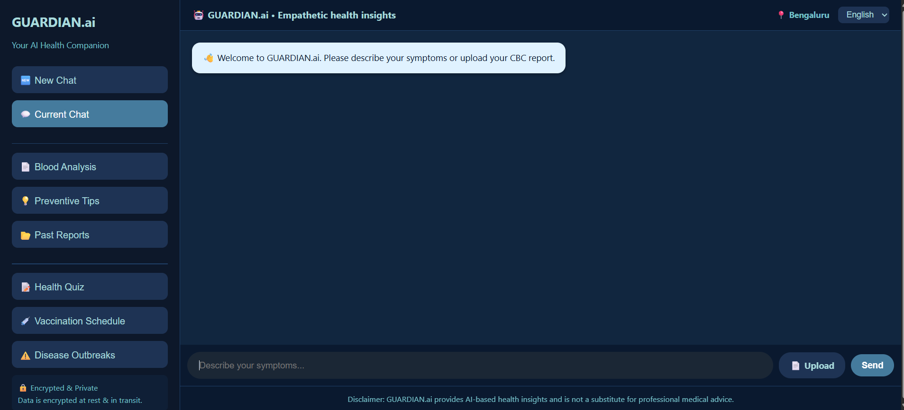
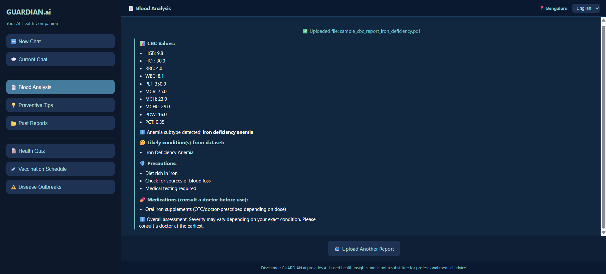
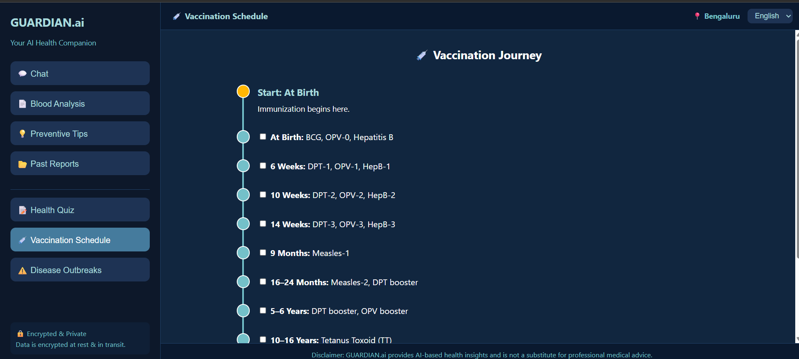
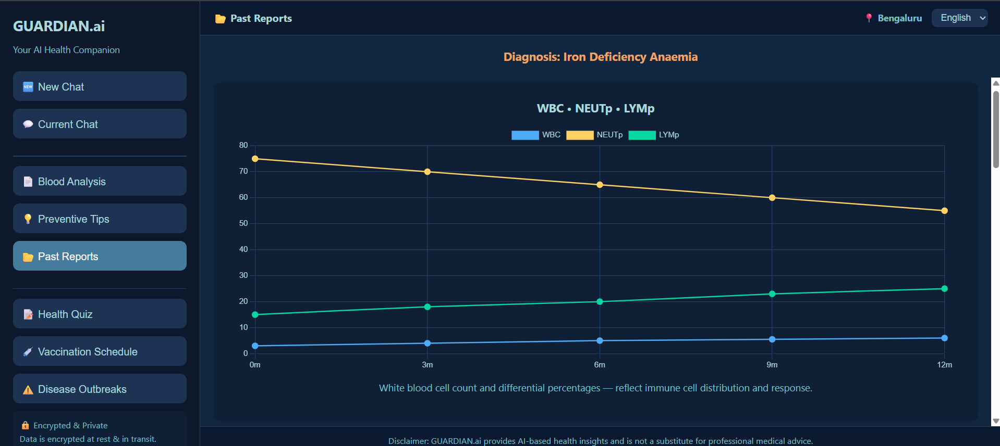

# 🩺 Guardian AI — AI-Powered Health Assistant

Guardian AI is an intelligent, healthcare assistant designed to provide **preventive care insights, symptom-based guidance, and blood report analysis** — making healthcare more accessible and actionable.

---

## 🚀 Key Features

* 🤖 **AI Chat Assistant**
  Get instant responses to health-related queries using LLM-powered conversational AI

* 🧠 **Symptom-Based Diagnosis**
  Hybrid system combining rule-based logic + AI to suggest possible conditions

* 🩸 **CBC Report Analysis (ML Model)**
  Upload your blood report → get automated insights using a trained ML model

* 📊 **Preventive Health Tips**
  Personalized recommendations to improve health and avoid risks

* 📁 **Past Reports Tracking**
  Store and review previous reports and analyses

* 💉 **Vaccination Schedule**
  Track and manage immunization timelines

---

## 🧠 How It Works

Guardian AI uses a **hybrid intelligence system**:

* 🔍 Rule-based engine for reliable symptom mapping
* 🤖 LLM (OpenAI) for conversational responses
* 📊 Machine Learning model for CBC report analysis
* 🔗 Flask backend serving real-time API responses

This combination ensures both **accuracy and flexibility** in health insights.

---

## 🏗️ Tech Stack

* **Backend:** Python, Flask
* **AI/ML:** OpenAI API, Scikit-learn
* **Data Processing:** pandas, numpy
* **Frontend:** HTML, CSS, JavaScript
* **Other Tools:** dotenv, REST APIs

---

## 📸 Screenshots

### 💬 Chat Interface



### 🩸 Blood Report Analysis



### 💉 Vaccination Schedule



### 📁 Past Reports



## ⚙️ Setup

### 1️⃣ Clone the repository

```bash
git clone https://github.com/swaroop05v/Guardian-AI.git
cd Guardian-AI
```

---

### 2️⃣ Install dependencies

```bash
pip install -r requirements.txt
```

---

### 3️⃣ Create `.env` file

```env
OPENAI_API_KEY=your_api_key_here
```

---

### 4️⃣ Run the server

```bash
python server.py
```

---

### 5️⃣ Open in browser

```
http://127.0.0.1:5000
```

---

## 📂 Project Structure

```bash
Guardian-AI/
 ├── data/
 ├── html/
 ├── models/
 ├── chatbot.py
 ├── server.py
 ├── train_cbc_model.py
 ├── requirements.txt
 ├── screenshots/
 └── .env
```

---

## 🔮 Future Improvements

* 🧑‍⚕️ Doctor consultation integration
* 📱 Mobile app version
* 🧠 Advanced deep learning models for diagnosis

---

## ⚠️ Disclaimer

Guardian AI provides AI-based health insights and is **not a substitute for professional medical advice**.

##

---

⭐ *Building technology that makes healthcare smarter and more accessible*
